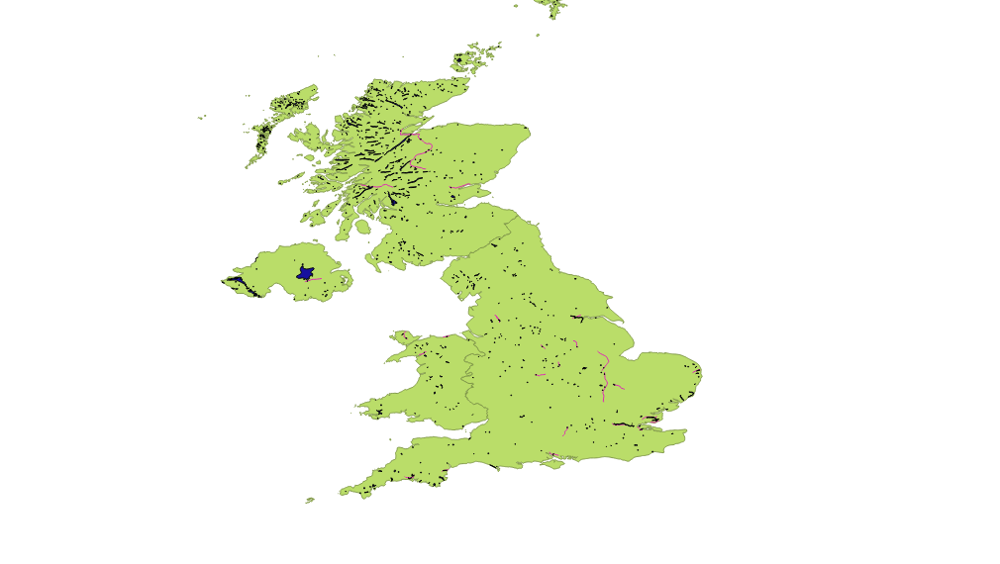

# GeoSpatialQueries
SQL based RDBMS queries for Geographical Information Systems (GIS)

We display items showcasing various sql like queries on geospatial data, to for example hightlight number of intersections on a map etc.

Attached are the results, the exact queries can be found in sql_queries.txt

